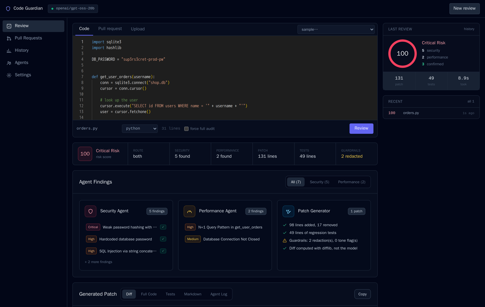
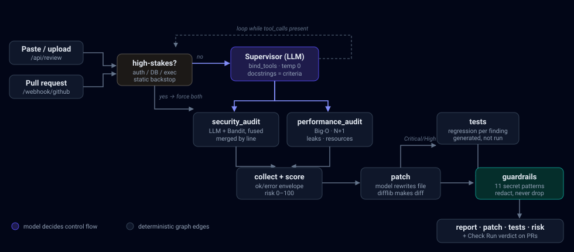
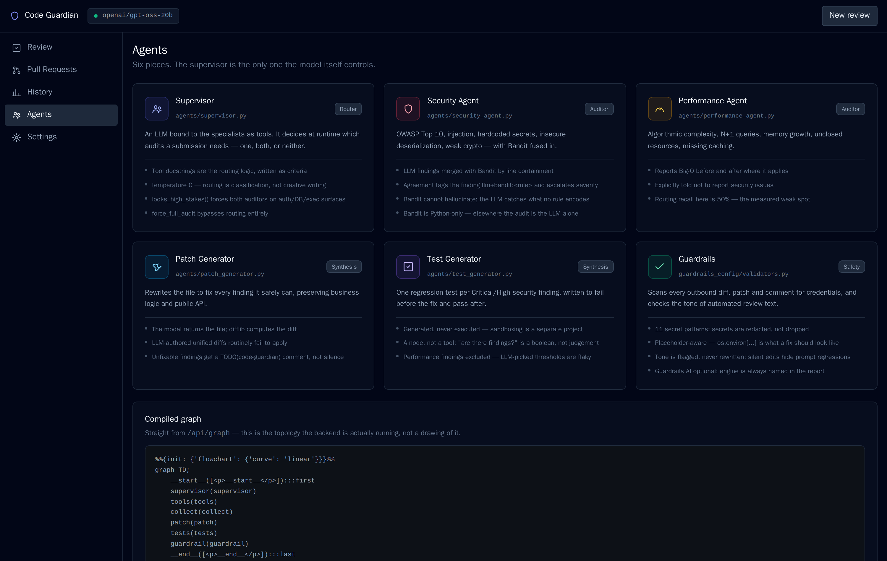

<div align="center">

# Code Guardian

**Multi-agent code reviewer where an LLM decides which specialists a diff actually needs.**

[](backend/tests)
[](#does-the-router-actually-work)
[](backend/app/graph.py)
[](backend/app/config.py)
[](#license)

</div>

<p align="center">
  
</p>

<p align="center">
  <sub>A real run on the bundled vulnerable-Python sample. The strip under the editor is
  every stage's actual outcome — route, each auditor, patch, tests, guardrails.</sub>
</p>

---

## What it does

A supervisor LLM is bound to the specialist auditors as **tools** and picks which
ones a submission needs — security, performance, both, or neither. Bandit runs
*inside* the security auditor, so every finding records whether the LLM found it,
the scanner found it, or both did independently. Findings become a risk score, a
patch, and a regression test.

And if an audit fails, the system **never reports "no issues found"** — it marks the
review incomplete.

| | |
|---|---|
| **Routes instead of fanning out** | A CSS file takes ~0.9s and calls no auditor; vulnerable Python takes ~11.4s and calls both. Adding an agent is one more `@tool` — the graph topology never changes. |
| **Fuses an LLM with a deterministic scanner** | Bandit cannot miss its own rules or hallucinate one; the LLM catches what no rule encodes. Agreement escalates severity and tags the finding `llm+bandit:B608`. |
| **Keeps failure distinct from silence** | `failed_audits` is a separate state. A failed audit yields risk band `unknown`, never `0/100 none`. |
| **Measures its own routing** | 40 labelled cases across two sets, one of them held out. Exit code gates on recall. |
| **Gates merges** | A Check Run on the PR: `failure` at high risk, `action_required` when the review was incomplete. |

---

<p align="center">
  
</p>

<p align="center">
  <sub>Indigo is the one node the <b>model</b> controls. Everything else is a deterministic edge —
  that distinction is the project's whole argument.</sub>
</p>

---

## Quick start

Needs a free [Groq API key](https://console.groq.com/keys).

```bash
cp backend/.env.example backend/.env      # then set GROQ_API_KEY=gsk_...
docker compose up --build
```

**UI** → http://localhost:3000  ·  **API** → http://localhost:8010/api/health

<sub>The backend is published on host port 8010 because 8000 is commonly taken.
Full instructions, local dev without Docker, and a troubleshooting table:
[docs/SETUP.md](docs/SETUP.md).</sub>

---

## Does the router actually work?

The design stakes itself on one claim — that letting a model route does not cost
recall. So it is measured, on two sets: one the tool docstrings were tuned against,
and one **never tuned against**.

| Set | Mode | Security recall | Performance recall |
|---|---|---|---|
| dev *(tuned against)* | router only | 90% | 50% |
| dev *(tuned against)* | as shipped | **100%** | 67% |
| **held-out** | router only | **89%** | 43% |
| **held-out** | as shipped | **100%** | 57% |

<sub>`openai/gpt-oss-20b`, 20 cases per set. Run it: `python -m evals.run_routing_eval --set both`</sub>

**As-shipped security recall is 100% on data never tuned against**, and the
dev/held-out gap is one point — the docstring tuning generalised rather than
overfitting. Performance routing is the honest weak spot at 43%.

Caveats, stated: 20 cases per set is small; the cases are self-written and
self-labelled; and these numbers are from `gpt-oss-20b` because the 120b daily quota
was exhausted that day.

> The held-out file carries its own rule: **a failing case changes neither the case
> nor the prompt it failed on.** A held-out set you edit after seeing the score is
> just a slower dev set.

---

## Verified

Every row below was run, not claimed.

| Check | Result |
|---|---|
| Backend unit tests | **107 passing**, no API key required |
| Vulnerable Python sample | 5 security + 2 performance findings; **3 confirmed by both engines**; Bandit caught 2 SQLi sites the LLM missed |
| Risk score | vulnerable Python **100/100 critical** · slow JS **10/100 low** · CSS **0/100 none** |
| Failed audit | band `unknown`, *"Audit failed — this code was not checked"*, never a clean pass |
| Webhook auth | valid HMAC **202** · tampered **401** · missing **401** · no secret **503** |
| API errors | missing key **503** · rejected key **502** · rate limited **429** |
| Compose stack + frontend build | both clean |

**Not verified:** the PR bot against a real repository — that needs a live PR.
Everything up to the GitHub API call is tested; the PyGithub calls are not.

---

## GitHub PR bot

On a pull request the bot reviews **the lines the PR adds**, comments once, and
publishes a Check Run that can block the merge.

```bash
# backend/.env
GITHUB_TOKEN=ghp_...                  # repo scope
GITHUB_WEBHOOK_SECRET=$(openssl rand -hex 32)
```

Repo → Settings → Webhooks → payload `https://<backend>/webhook/github`, content type
`application/json`, event **Pull requests** only.

- **Fails closed.** No secret configured → 503, nothing processed. A public URL that
  runs LLM calls and writes comments is a denial-of-wallet vector. Signatures use
  `hmac.compare_digest`.
- **Returns 202 immediately**, reviews in the background — GitHub abandons a delivery
  after 10 seconds.
- **Check Run verdict:** `failure` at high/critical risk, `success` below,
  `action_required` when an audit did not run. Passing would be dangerous and failing
  would be wrong, because nothing is known.
- `POST /api/review-pr` reviews a PR on demand and **posts nothing** — it returns the
  comment it *would* post, for preview.

---

## Stack

**LangGraph** `StateGraph` (supervisor loop, conditional edges, reducers) ·
**Groq** via LangChain · **Bandit** fused into the security audit ·
**FastAPI** · **React + Vite + Tailwind + Monaco** · **PyGithub** · **Docker Compose**

<details>
<summary>Project layout</summary>

```
backend/app/graph.py            LangGraph state machine
backend/app/state.py            ReviewerState schema
backend/app/risk.py             Weighted risk score
backend/app/pr_bot.py           HMAC verification, PR review, Check Run verdict
backend/app/agents/             Supervisor, Security, Performance, Patch, Tests
backend/app/agents/static_analysis.py   Bandit fusion: scan, map, dedupe, merge
backend/app/guardrails_config/  Secrets + tone validators
backend/app/mcp_clients/        GitHub client (PyGithub)
backend/tests/                  107 tests for the LLM-free seams
backend/evals/                  40 labelled cases: 20 dev + 20 held-out
frontend/src/                   React dashboard
docs/                           9 docs — start with PROJECT_WALKTHROUGH.md
```

</details>

<details>
<summary>What the dashboard shows — and what it deliberately doesn't</summary>

<p align="center">
  
</p>

Built to look like a tool, not a landing page: no hero, no tagline, no gradients.
Five nav items, all of which do something. The Agents page above reads its graph
from `/api/graph`, so it shows the topology the backend is running rather than a
drawing of it.

- **Run strip, risk donut, agent cards, patch, tests, agent log** — straight from the
  review.
- **History** is built from `localStorage`, because the backend is stateless by
  design. Real, but per-browser: clearing site data wipes it.
- **`confirmed` badges** mark findings both engines flagged independently.
- **Pull Requests** says it needs `GITHUB_TOKEN` rather than rendering placeholder
  rows. A "Repository" page was removed — repo-wide review is not built, and a nav
  item that leads nowhere is worse than a missing one.
- **No cost-per-review tile.** It has not been measured, and this project does not
  display numbers it has not measured.

</details>

---

## Docs

**Start here → [Project Walkthrough](docs/PROJECT_WALKTHROUGH.md)** — the whole system
in one file: flowchart, how each piece was built and why, and the seven bugs only real
runs and tests found.

| Doc | For |
|---|---|
| [TECHNICAL_SPEC](docs/TECHNICAL_SPEC.md) | architecture, graph topology, §3a routing argument, deviations |
| [CODE_NOTES](docs/CODE_NOTES.md) | file-by-file *why this exists* |
| [CODE_QA](docs/CODE_QA.md) | 36 questions to defend the code, with answers |
| [INTERVIEW_NOTES](docs/INTERVIEW_NOTES.md) | pitch, trade-offs, limitations, demo script, honesty checklist |
| [AGENT_FUNDAMENTALS](docs/AGENT_FUNDAMENTALS.md) | agent / tool-calling / evaluation concepts + question bank |
| [ROADMAP](docs/ROADMAP.md) | done, left, and deferred with reasons |
| [SETUP](docs/SETUP.md) · [BUILD_AND_DEPLOY](docs/BUILD_AND_DEPLOY.md) | running it, shipping it |

---

## Status

Phases 1 and 2 are implemented, along with static-analysis fusion, risk scoring, test
generation, the Check Run gate, and a held-out routing eval.

Deliberately deferred: repo-wide RAG, vector-DB team memory, and a sandboxed
self-healing patch loop. Each is its own multi-week project rather than a node this
graph can absorb — the reasoning is in [ROADMAP](docs/ROADMAP.md).

## License

MIT
