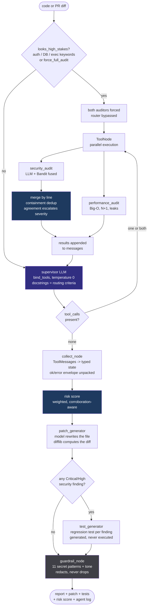

# Project Walkthrough — what was built, how, and how it works

This is the whole project **in one place**: the flowchart, what each step does and why,
and at the end how the complete system runs. If you only read one file, read this one.

What the other docs are for:
[TECHNICAL_SPEC](TECHNICAL_SPEC.md) architecture and design decisions ·
[CODE_NOTES](CODE_NOTES.md) file-by-file "why this exists" ·
[CODE_QA](CODE_QA.md) defend your own code, question by question ·
[INTERVIEW_NOTES](INTERVIEW_NOTES.md) the pitch and Q&A ·
[AGENT_FUNDAMENTALS](AGENT_FUNDAMENTALS.md) general agent/tool-calling concepts ·
[ROADMAP](ROADMAP.md) what is left ·
[BUILD_AND_DEPLOY](BUILD_AND_DEPLOY.md) priorities and deployment.

---

## 1. In one line

Code or a PR diff → **an LLM decides which specialist auditors this input actually
needs** → the chosen auditors run in parallel (the security one with a deterministic
scanner fused into it) → their findings are merged, scored, and turned into a patch and
a regression test → everything leaving the system is scanned for secrets.

The naive version of this product is one big prompt that says "review this code".
That prompt pays for a full security analysis on a CSS file, has no way to tell
"I looked and found nothing" from "I never ran", and has nothing to check it against.
**Here each of those three is a decision the system makes out loud, and two of them are
measured.**

---

## 2. The full journey of one submission (flowchart)



The same graph serves both entry points. `/api/review` feeds it a paste from the UI;
`/webhook/github` feeds it the lines a pull request **adds**, one file at a time.

---

## 3. How it was built — step by step

### Step 1 — The state, and why `messages` is in it

[backend/app/state.py](../backend/app/state.py)

The spec sketched a flat `ReviewerState`. Two fields got added that the sketch left
implicit:

- `messages` with the `add_messages` reducer — the supervisor is a tool-calling loop, so
  it needs message history, not just findings.
- `force_full_audit` — the caller-side override for high-stakes paths.

Later steps added `failed_audits`, `audit_errors`, `risk`, `generated_tests`.

One gotcha that cost a debugging session: on Python 3.11 **pydantic rejects
`typing.TypedDict`**. It has to come from `typing_extensions`, or the graph does not
compile at all. The error surfaces at `build_graph()`, nowhere near the import.

### Step 2 — The supervisor as a router, not a fan-out

[backend/app/agents/supervisor.py:68-107](../backend/app/agents/supervisor.py#L68-L107)

The two specialists are exposed as `@tool`s and bound with `llm.bind_tools(TOOLS)`. The
model picks. **The docstrings are the routing logic** — they are written as criteria
("call this when the code does any of…"), not as prose descriptions.

The tools take **no arguments**. The submission reaches them through a `ContextVar`
([supervisor.py:41](../backend/app/agents/supervisor.py#L41)) rather than a tool
argument, because making the model echo an entire diff back through its own tool call
would pay for those input tokens twice and risk it truncating the code.

A `ContextVar` and not a module global: the API serves concurrent requests, and a global
dict would let two simultaneous reviews audit each other's code.

### Step 3 — The backstop, because the router can be wrong

[supervisor.py:134-158](../backend/app/agents/supervisor.py#L134-L158)

`looks_high_stakes()` force-runs both auditors when the input obviously touches auth, a
database, or an exec surface. Deliberately over-inclusive — a false positive costs one
extra audit, a false negative costs a vulnerability.

Writing it surfaced a bug worth remembering: `\b` **does not fire between an underscore
and a letter**, so `\bpassword\b` misses `DB_PASSWORD` and `check_password` — exactly the
names real code uses. The boundaries are lookarounds now. The same bug was sitting in the
secrets guard.

### Step 4 — Making a failed audit impossible to mistake for a clean one

[graph.py:43-68](../backend/app/graph.py#L43-L68)

This is the most important thing in the repo, and it started as a real bug.

Groq retired `llama-3.3-70b-versatile`. Every audit started returning 404. LangGraph's
`ToolNode` turns an uncaught exception into a plain-text `ToolMessage`; the collector
JSON-parsed it, got `[]`, and the system cheerfully reported **0 findings on code with a
Critical SQL injection**.

For an auditing tool that is the worst possible failure: silence became indistinguishable
from a pass. The fix has three parts:

1. Each tool returns `{"ok": bool, ...}` ([supervisor.py:50-66](../backend/app/agents/supervisor.py#L50-L66)).
2. Anything unparseable counts as an **error**, not an empty result.
3. The report refuses to print "No issues found" for an audit that never ran — it leads
   with an "incomplete review" banner instead.

### Step 5 — The patch, and why `difflib` writes the diff

[backend/app/agents/patch_generator.py](../backend/app/agents/patch_generator.py)

The model is asked only for the **rewritten file**. The unified diff is computed locally.

Asking an LLM for a unified diff is a well-known way to get hunk headers and line counts
that are subtly wrong, and such a patch will not apply. Deriving it from the two texts is
exact by construction and costs nothing.

### Step 6 — Guardrails, and what they are actually made of

[backend/app/guardrails_config/validators.py](../backend/app/guardrails_config/validators.py)

11 secret patterns plus a tone check, run over the diff, the report and the patched code.
Secrets are **redacted, not dropped**, so the reviewer still sees the shape of the patch.

`guardrails-ai` is used when installed but is optional — some of its hub validators pull a
full torch install, a bad trade for a container that otherwise fits in a few hundred MB.
`guardrail_report.engine` always names which engine produced the result, so nobody is
misled about it. **Do not say "Guardrails AI" in an interview without saying this.**

The guard is placeholder-aware: it must not flag the `os.environ[...]` that the patch
agent is *supposed* to emit when it removes a secret.

### Step 7 — Measuring the router instead of asserting it

[backend/evals/](../backend/evals/)

§3a of the spec claims three mitigations for the router's false-negative risk. The third
one — an eval set measuring recall — did not exist, so it got built: 20 labelled snippets
scored in two modes.

Two modes matter. `router-only` is the model's judgement alone; `as-shipped` includes the
backstop. Reporting only the second would flatter the model, because the backstop catches
much of what it misses.

The eval immediately earned its keep: **performance recall was 33%**. Rewriting the
performance tool's docstring as explicit criteria moved it to 50%. Docstring changed →
routing behaviour changed, with no edge rewiring. That is §3a's whole argument, observed.

### Step 8 — Fusing a deterministic scanner into the security audit

[backend/app/agents/static_analysis.py](../backend/app/agents/static_analysis.py)

Bandit runs as a subprocess **inside** the existing `security_audit` tool. No graph
change; one new `source` field on `Finding`.

Neither engine subsumes the other, and the distinction is worth stating precisely:

- Bandit cannot miss a pattern it has a rule for, and cannot hallucinate one it does not.
- The LLM catches what no rule encodes — a missing authorization check, a business-logic
  flaw — and explains it in context.

When both flag the same line the finding is tagged `llm+bandit:<rule>` and takes the
higher severity. Two bugs only showed up on a real run:

- Bandit's `code` field returns **numbered context lines**, so taking the first one
  yielded a neighbouring, often blank, line. It also broke dedup, because the hint no
  longer matched the LLM's quote of the real line.
- Dedup compared normalised hints for **equality**, but the LLM quotes an expression
  (`hashlib.md5(...) == stored`) while the scanner reports the whole statement
  (`return hashlib.md5(...) == stored`). Containment, with a length floor.

### Step 9 — One number to triage on

[backend/app/risk.py](../backend/app/risk.py)

Weights are calibrated against the bands, not picked for roundness: one Critical finding
must reach *high* and two must reach *critical*, because a single remotely exploitable
vulnerability has to be enough to stop a merge once a Check Run gate reads this.

The first version had `Critical = 40` against a 50-point band, so a lone Critical scored
as *medium*. The test written for the property caught it before it shipped.

Three properties the tests pin down:

- **An incomplete review can never look safe** — a failed audit yields `band: "unknown"`,
  not `0/none`. The silent-pass bug does not get to come back wearing a number.
- **Findings dominate; size only modulates** — capped at +25%, so a 2000-line clean diff
  still scores 0.
- **Corroboration counts** — `llm+bandit` findings weigh 1.25×; performance findings are
  discounted to 0.4×, because a slow query is a cost and a SQL injection is a breach.

### Step 10 — The PR bot

[backend/app/pr_bot.py](../backend/app/pr_bot.py) ·
[backend/app/mcp_clients/github_client.py](../backend/app/mcp_clients/github_client.py)

Reviews the lines a PR **adds**, not whole files: flagging a pre-existing issue in an
untouched context line is noise the author cannot act on in this PR.

Four behaviours worth knowing:

- **Fails closed.** No `GITHUB_WEBHOOK_SECRET` → 503, nothing processed. A public URL
  that runs LLM calls and writes comments is a denial-of-wallet vector. Signatures are
  compared with `hmac.compare_digest`, because `==` leaks the correct prefix length
  through timing.
- **202 immediately**, review in the background. GitHub abandons a delivery after 10s.
- **Scope control.** Drafts skipped, non-actionable events ignored, lockfiles and
  vendored paths filtered, capped at 10 files ranked by additions so the cap drops trivia.
- **A file whose review crashes is reported as a failed audit**, not omitted.

Naming honesty: the folder is `mcp_clients/` and the spec said "GitHub MCP Server /
PyGithub". **This is PyGithub.** Running the MCP server would mean a second container to
wrap REST calls this backend already makes, and MCP's value — a *model* discovering and
calling tools at runtime — does not apply to fixed, webhook-driven calls. If you say
"MCP" about this project, say it about the supervisor.

### Step 11 — Regression tests, generated but never run

[backend/app/agents/test_generator.py](../backend/app/agents/test_generator.py)

One test per Critical/High security finding, written to fail against the original code
and pass once fixed.

**Nothing here executes what it writes.** Running LLM-authored tests safely needs a
sandboxed runtime with no network, a filesystem it cannot escape, and a hard timeout —
that is an infrastructure project, not a review-agent feature. Emitting a test a human
reads and runs is the honest 80%; pretending to have verified it is the dangerous 20%.

It is a **node, not a `@tool`**, which is where the spec's sketch put it. §3a's own
argument is that the model owns control flow only where the decision needs judgement.
"Which audits is this diff worth paying for?" needs judgement. "Are there findings to
write tests for?" is a boolean over state the graph already holds.

Performance findings are excluded: a benchmark threshold picked by an LLM with no machine
to measure on is a flaky test, which is worse than no test.

---

## 4. How the whole system works now

### 4.1 Component map

| Layer | File | Job |
|---|---|---|
| Router | `agents/supervisor.py` | picks auditors; backstop; forced fan-out |
| Auditors | `agents/security_agent.py`, `performance_agent.py` | findings with severity |
| Scanner | `agents/static_analysis.py` | Bandit, fused into the security audit |
| Synthesis | `agents/patch_generator.py`, `agents/test_generator.py` | patch, regression tests |
| Orchestration | `graph.py` | nodes, edges, collector, report |
| Scoring | `risk.py` | one triage number |
| Safety | `guardrails_config/validators.py` | secrets + tone on everything outbound |
| API | `main.py` | `/api/review`, `/api/health`, `/api/graph`, `/webhook/github` |
| PR bot | `pr_bot.py`, `mcp_clients/github_client.py` | HMAC, diff fetch, comment |
| UI | `frontend/src/` | Monaco, findings, patch, markdown, agent log |

### 4.2 What stops a wrong answer — four layers

1. **The backstop** stops the router from skipping a security audit it should have run.
2. **The `ok/error` envelope** stops a failed audit from reading as a clean one.
3. **Bandit** stops the LLM from being the only opinion on a known-rule vulnerability.
4. **The guardrail** stops a secret from leaving in a patch or a PR comment.

### 4.3 What was verified

| Check | Result |
|---|---|
| Unit tests | **97 pass**, no API key needed |
| Routing eval, 20 cases | **security recall 100%** (0 false negatives); performance recall 50% router-only, 67% as-shipped |
| Static fusion, vulnerable Python | 8 raw findings → **5** after dedup; **3 confirmed by both engines**; Bandit added 2 SQLi sites the LLM missed |
| Risk score | vulnerable Python **100/100 critical**, slow JS **10/100 low**, plain CSS **0/100 none** |
| Failed audit | band `unknown`, "score unavailable", "Audit failed — this code was not checked" |
| Test generation | 88 lines of pytest for 3 findings |
| Router cost contrast | CSS **~0.9s** (no auditor) vs vulnerable Python **~11.4s** (both + patch + tests) |
| Webhook auth | valid HMAC **202** · tampered **401** · missing **401** · no secret configured **503** |
| API errors | missing key **503** · rejected key **502** · rate limited **429** |
| Frontend | production build clean |

### 4.4 Bugs that only real runs found

Five, and they are the most interesting thing in the project:

1. **Silent clean pass** — a 404 from a retired model reported as "0 findings" on
   vulnerable code.
2. **`\b` and underscores** — `DB_PASSWORD` and `check_password` slipped past both the
   secrets guard and the routing backstop.
3. **`typing.TypedDict`** — pydantic rejects it on 3.11; the graph would not compile.
4. **Bandit's numbered context lines** — the reported line was a neighbouring blank one,
   which also silently broke dedup.
5. **"garbage collection" flagged as an insult** — a finding explaining that a cursor
   "relies on garbage collection" tripped the tone guard. A guard that cries wolf on
   correct technical writing is a guard people learn to ignore; the benign senses of
   *garbage*, *lazy*, *dumb* and *trash* are now excluded explicitly.

A sixth was caught by a test rather than a run: `Critical = 40` against a 50-point band
scored a lone Critical finding as *medium* risk.

---

## 5. What is left

- **2a — the PR bot against a real repository.** Everything up to the GitHub API call is
  tested; the PyGithub calls themselves are not. Needs a `GITHUB_TOKEN` and a live PR.
- **2e — Check Run status**, to turn "posts a comment" into "can gate a merge". The risk
  score it needs already exists.
- **Phases 3–5** stay deferred on purpose — each is its own multi-week project (repo
  ingestion, embeddings, a sandboxed execution runtime), not a node this graph absorbs.

See [ROADMAP](ROADMAP.md).

---

## 6. Quick reference

### Commands

```bash
docker compose up --build                    # UI :3000, API :8010

cd backend && pytest -q                      # 97 tests, no key needed
cd backend && python -m evals.run_routing_eval   # needs a key, ~20 calls

curl https://api.groq.com/openai/v1/models -H "Authorization: Bearer $GROQ_API_KEY"
```

### The files that matter most

1. `backend/app/agents/supervisor.py` — the differentiating piece
2. `backend/app/graph.py` — the orchestration, and the silent-pass fix
3. `backend/app/agents/static_analysis.py` — the fusion
4. `backend/app/risk.py` — the triage number
5. `backend/evals/run_routing_eval.py` — the proof the router works

### Env vars that change behaviour

| Var | Effect |
|---|---|
| `GROQ_API_KEY` | required; absent → 503 |
| `GUARDIAN_MODEL` | must support tool calling; Groq retires ids, check before demoing |
| `GITHUB_TOKEN` | PR bot can read and comment |
| `GITHUB_WEBHOOK_SECRET` | absent → webhook 503, fail closed |
| `force_full_audit` (request field) | bypasses routing entirely |
